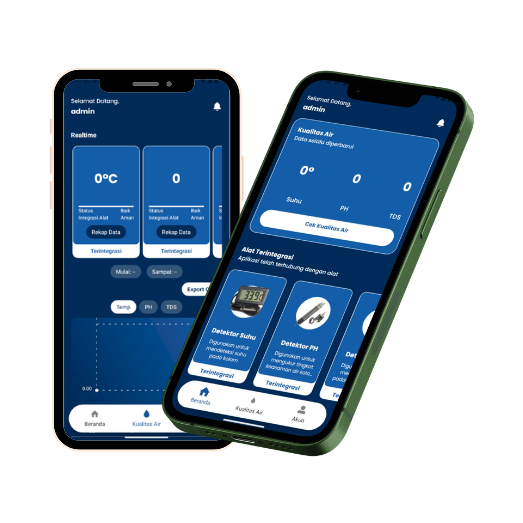
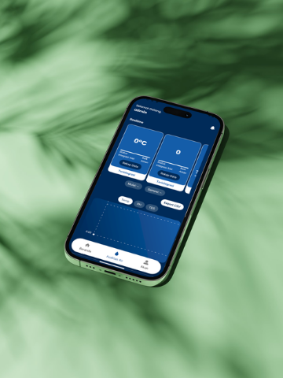

<div align="center">

# MONIKA — Mobile App
### Dashboard Pemantauan Kualitas Air Tambak Udang

<p>
  Aplikasi mobile React Native untuk memantau data sensor ESP32 secara <strong>real-time</strong> melalui Firebase,
  dilengkapi grafik historis, export data, dan manajemen perangkat IoT.
</p>



<br/>


</div>

---

## Tampilan di Perangkat

<div align="center">
  
</div>

---

## Fitur

| Fitur | Deskripsi |
|---|---|
| **Realtime Monitoring** | Nilai pH, Suhu, dan TDS langsung dari ESP32 via Firebase RTDB |
| **Grafik Historis** | Line chart data sensor dengan filter rentang tanggal |
| **Export Data** | Unduh rekap data sensor ke file |
| **Manajemen Alat** | Sambungkan perangkat ESP32 via QR Code scan |
| **Notifikasi** | Peringatan otomatis saat nilai sensor di luar batas normal |
| **Autentikasi** | Login & registrasi akun via Firebase Auth |
| **Multi-device** | Satu akun dapat mengelola beberapa ESP32 |

---

## Tech Stack

- **[Expo](https://expo.dev)** SDK 54 dengan **[Expo Router](https://expo.github.io/router)** (file-based navigation)
- **[React Native](https://reactnative.dev)** 0.81.5 + **TypeScript** 5.9
- **[NativeWind](https://www.nativewind.dev)** v4 — Tailwind CSS untuk React Native
- **[Firebase](https://firebase.google.com)** v11 — Auth, Firestore, Realtime Database
- **[react-native-chart-kit](https://github.com/indiespirit/react-native-chart-kit)** — visualisasi grafik

---

## Struktur Proyek

```
mobile/
├── app/
│   ├── (auth)/
│   │   ├── Login.tsx
│   │   └── Signup.tsx
│   ├── (componens)/
│   │   ├── Header.tsx
│   │   ├── Notification.tsx
│   │   ├── Setting.tsx
│   │   └── Detailalat.tsx
│   ├── (tabs)/
│   │   ├── Beranda.tsx        # Dashboard realtime
│   │   ├── KualitasAir.tsx    # Grafik & histori data
│   │   ├── Udang.tsx          # Manajemen udang
│   │   └── Akun.tsx           # Profil pengguna
│   └── _layout.tsx
├── assets/
│   ├── fonts/
│   └── images/
├── hooks/
│   ├── rtdbPath.ts            # Utility path Realtime DB
│   ├── QRCodeScanner.tsx      # Scanner QR untuk pairing alat
│   └── TabBar.tsx
├── firebase.js                # Firebase initialization
├── .env                       # Credentials (tidak diupload)
└── .env.example               # Template credentials
```

---

## Instalasi & Menjalankan

### Prasyarat
- Node.js >= 18
- [Expo Go](https://expo.dev/go) di smartphone (untuk development)
- Akun Firebase

### Langkah Setup

**1. Install dependencies**
```bash
npm install
```

**2. Setup environment variables**
```bash
cp .env.example .env
```

Isi `.env` dengan nilai dari [Firebase Console](https://console.firebase.google.com) → Project Settings:
```env
EXPO_PUBLIC_FIREBASE_API_KEY=your-api-key
EXPO_PUBLIC_FIREBASE_AUTH_DOMAIN=your-project.firebaseapp.com
EXPO_PUBLIC_FIREBASE_DATABASE_URL=https://your-project-rtdb.asia-southeast1.firebasedatabase.app/
EXPO_PUBLIC_FIREBASE_PROJECT_ID=your-project-id
EXPO_PUBLIC_FIREBASE_STORAGE_BUCKET=your-project.firebasestorage.app
EXPO_PUBLIC_FIREBASE_MESSAGING_SENDER_ID=your-sender-id
EXPO_PUBLIC_FIREBASE_APP_ID=your-app-id
EXPO_PUBLIC_FIREBASE_MEASUREMENT_ID=your-measurement-id
```

**3. Jalankan**
```bash
npx expo start
```

| Perintah | Platform |
|---|---|
| Tekan `a` | Android Emulator |
| Tekan `i` | iOS Simulator |
| Tekan `w` | Browser |
| Scan QR | Expo Go di HP |

---

## Konfigurasi Firebase

1. Buat project di [Firebase Console](https://console.firebase.google.com)
2. Aktifkan **Authentication** → Sign-in method: Email/Password
3. Aktifkan **Firestore Database**
4. Aktifkan **Realtime Database**
5. Tambahkan Web App → salin config ke `.env`

**Struktur Realtime Database:**
```
{DEVICE_ID}/
  ├── PH      (number)
  ├── TDS     (number)
  └── Temp    (number)
```

**Struktur Firestore:**
```
users/{userId}/
  └── deviceId  (string)  ← ID perangkat ESP32 milik user
```

---

## Environment Variables

| Variable | Keterangan |
|---|---|
| `EXPO_PUBLIC_FIREBASE_API_KEY` | Firebase Web API Key |
| `EXPO_PUBLIC_FIREBASE_AUTH_DOMAIN` | Firebase Auth Domain |
| `EXPO_PUBLIC_FIREBASE_DATABASE_URL` | Realtime Database URL |
| `EXPO_PUBLIC_FIREBASE_PROJECT_ID` | Firebase Project ID |
| `EXPO_PUBLIC_FIREBASE_STORAGE_BUCKET` | Firebase Storage Bucket |
| `EXPO_PUBLIC_FIREBASE_MESSAGING_SENDER_ID` | Messaging Sender ID |
| `EXPO_PUBLIC_FIREBASE_APP_ID` | Firebase App ID |
| `EXPO_PUBLIC_FIREBASE_MEASUREMENT_ID` | Analytics Measurement ID |

> File `.env` tidak pernah diupload ke GitHub. Gunakan `.env.example` sebagai panduan.

---

## Build Produksi (EAS Build)

```bash
# Install EAS CLI
npm install -g eas-cli

# Login ke akun Expo
eas login

# Build APK (preview/testing)
eas build --platform android --profile preview

# Build untuk Google Play Store
eas build --platform android --profile production
```

---

## Lisensi

MIT License

---

<div align="center">
  <p>Bagian dari sistem MONIKA — <a href="../README.md">Lihat README utama</a></p>
</div>
